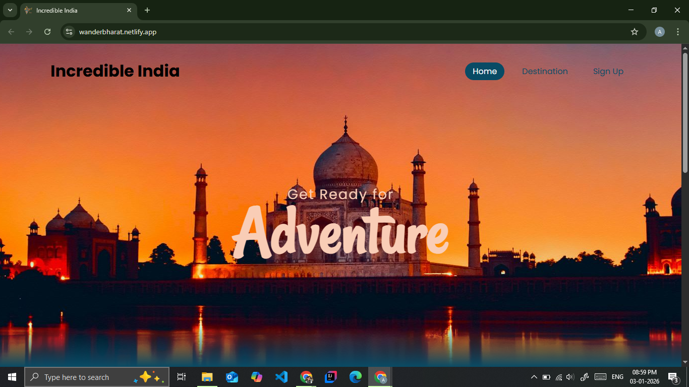
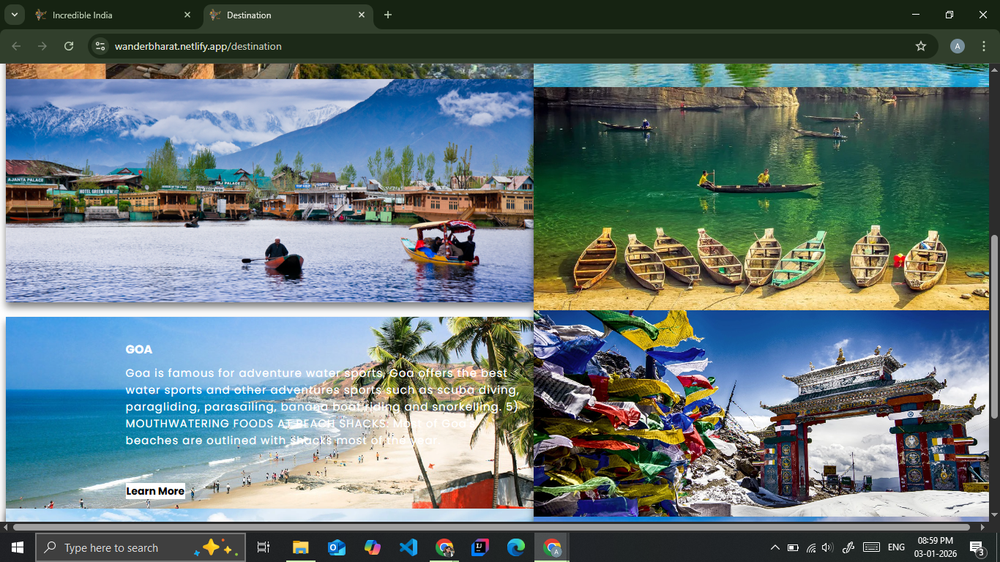
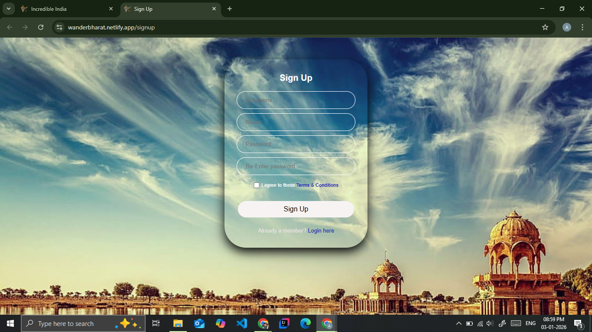

# 🌍 Travel India Website

A responsive and visually engaging travel website that showcases popular tourist destinations across India.  
This project is designed to provide users with an overview of India’s cultural, historical, and scenic attractions.

## 🚀 Live Demo
🔗 (https://wanderbharat.netlify.app/)

## 🛠️ Tech Stack
- HTML  
- CSS  
- JavaScript  

## ✨ Features
- Responsive design for desktop and mobile devices
- Clean and user-friendly UI
- Showcases multiple Indian travel destinations
- Simple navigation and structured layout

## 📸 Screenshots

### 🏠 Home Page

### 🗺️ Destinations Section

### 🖼️ Sign-Up Section

## 🎯 Purpose of the Project
- Practice frontend web development concepts
- Improve HTML, CSS, and JavaScript skills
- Build a real-world project for portfolio and GitHub

## 📌 Future Improvements
- Add dynamic content using APIs
- Improve animations and transitions
- Add booking or contact functionality

## 👩‍💻 Author
**Anshu Kumari**  
- GitHub: https://github.com/anshukumari76  
- Portfolio: https://portfolioanshukumari.netlify.app/
